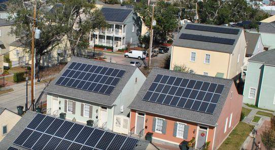
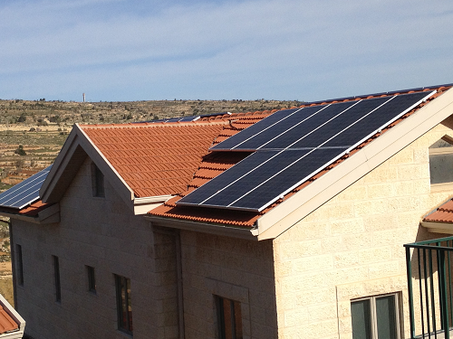

``` {r cache=TRUE, echo=FALSE, results="hide" }
byDay <- read.csv("byDay.csv")
energyDatawithNA <- read.csv("energyDatawithNA.csv")
```

## Background

- Deployments of Photovoltaic Solar Panel arrays on residences has grown in recent years.
- Systems are usually Ethernet enabled - they report data back to a server


!["Growth Projections - Wikipedia"] (GrowthofDeployments.png)

--- 

## Monitoring App
 
This website monitors data from the SolarEdge company.  The following steps are required:

1. Solar panels report back to SolarEdge's servers.
2. An API pulls the data into R (I wrote a wrapper around the company's API)
3. The data is aggregated to a daily level.
-- The data is pulled on an quarter-hour basis. 
4. The user specifies the dates he's interested in. 
5. The graph displays the results. 


--- 

## Case Study 

- One sample home has 40 300-watt panels 
- The system was installed in February 2013
- `r format(nrow(energyDatawithNA),big.mark = ",")` raw records retrieved through 31 August 2015
- After consolidation to daily data, we have `r nrow(byDay)` rows



---

## Monitoring App

- This site enables users to query the data for a particular time interval
- A trend line is provided 
- It can be expanded 
  + to pull data from the SolarEdge site in real-time
  + pull data for other installations (it's currently only got 1 supported site)

The site's address is:  
https://dsamson.shinyapps.io/SolarPowerGeneration

---


